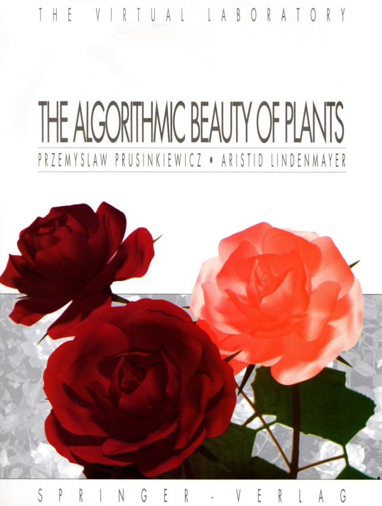

```
Created on  2019.05.24.15:44
L-System 改编：Moly Chin
@author: molychin@qq.com
```

### L系统

L－系统是匈牙利生物学家Aristid LinderMayer于1968年提出的。.L－系统的本质是一个重写系统，通过对植物对象生长过程的经验式概括和抽象，初始状态与描述规则，进行有限次迭代，生成字符发展序列以表现植物的拓扑结构，并对产生的字符串进行几何解释，就能生成非常复杂的分形图形。
Lindenmayer系统，简称L系统，是由荷兰Utrecht大学的生物学和植物学家，匈牙利裔的林登麦伊尔（Aristid Lindenmayer）于1968年提出的有关生长发展中的细胞交互作用的数学模型，尤其被广泛应用于植物生长过程的研究。
L-system是一系列不同形式的正规语法规则，多被用于植物生长过程建模，但是也被用于模拟各种生物体的形态。L-system也能用于生成自相似的分形，例如迭代函数系统。

#### 详细介绍
一类动态细胞自动机，在每一（时间）步上，其中的各个细胞可以由给定状态变为一个新的状态，或消亡或分裂为具有某种状态组合的细胞串。A.林顿梅伊尔曾用这种细胞自动机描述丝状有机体的发育过程，所以叫作林顿梅伊尔系统，简称L系统。
在乔姆斯基形式语言理论中，字母表被分成终结字母表和非终结字母表部分，“字”是由终结字母组成的字母序列。在L系统中，没有单独的终结字母表,所有生成的字都在系统语言中；初始字母可以被初始字所代替；被注视的字所包含的各个字母同时进行改写。每个字母代表一个细胞，用字表示细胞阵列发展的阶段。生成式对应于发展指令，这些指令的应用使有机体生长成已知类型。消亡的细胞可以用空字 e表示。细胞之间可以有，也可以没有交互作用（信息传递）。有交互作用的有1L系统和2L系统。没有交互作用的叫作0L系统。

0L系统是一个三元组Γ=(G，g，δ),其中G为一个有限非空集合，叫作字母表；g为G中元素的非空序列，即非空字；δ为一个(转移)函数，首先取作从G到G*（G中元素所能构成的一切序列的集合）的有限非空子集的映射。然后,把δ扩充为从G*到G*的有限非空子集的映射。
如果空字e不能替换任何字母，即对 G中所有字母ɑ，都有e唘δ(ɑ)，就称Γ为增殖0L系统，简称P0L系统；如果对字母表内每一个字母有且只有一个转移规则，即对G中所有ɑ，在G*中只有一个字p使δ(ɑ)={p}，就称Γ为确定的0L系统，简称 D0L系统。显然（P0L∪D0L）吇0L。而既增殖又确定的DL系统称为DP0L。


#### 使用 L-系统 生成的 3D 杂草
1 起源
2 L-system 结构
3 L系统的例子
3.1 例1：海藻的生长
3.2 例1的解释
4 开放问题
5 参考文献
6 外部链接
7 参见

##### 起源
作为一位生物学家，Lindenmayer工作的内容是酵母菌和丝状真菌，并研究多种类型的海藻的生长模式，例如蓝绿细菌项圈藻（Anabaena catenula，淡水藻类的一种）。最初，L系统被设计成用于提供一种关于简单多细胞生物体生长的正规描述，并且试图证明植物细胞之间的紧密关系。不久以后，这个系统被扩展成描述高等植物及其复杂枝杈结构。

###### L-system 结构
**L-system的自然递归规则导致自相似性**，也因此使得分形一类形式可以很容易的使用L-system描述。植物模型和自然界的有机结构生成，非常相似并很容易被定义，因此通过增加递归的层数，可以缓慢生长并逐渐变得更复杂。L-system同样在制造人造生命领域。 L-system 语法与Chomsky语法非常相似，说到L-system通常指的是带参数的L-system，定义如下：

G＝｛V,S,ω,P},

V:变量符号集合  
S：常量符号集合  
ω：初始状态串  
P：产生式规则

自初始状态开始迭代套入L-system的文法规则，和正规文法所产生的语言不同处在于，L-system在一次迭代中可同时套用许多不同的文法规则。如果在一次迭代中只能够套用一个文法规则，产生出来的结果被称为语言而不是L-system。由此可知，L-system为正规文法所产生出的语言的子集合。

###### L系统的例子
例1：海藻的生长
Lindenmayer研究海藻生长模式时提出的最早的L-系统：
```
变量 : A B
常量 : 无
公理 : A
规则 : (A → AB), (B → A)
```

迭代过程：
```
n = 0 : A
n = 1 : AB
n = 2 : ABA
n = 3 : ABAAB
n = 4 : ABAABABA
n = 5 : ABAABABAABAAB
n = 6 : ABAABABAABAABABAABABA
n = 7 : ABAABABAABAABABAABABAABAABABAABAAB
```
例1的解释
```
n=0:         A           开始 (公理/起始点)
            /
n=1:       A   B         根据规则(A → AB)起始点A拓展成AB，由于起始点没有B，规则(B → A)没有被用到
          /|    
n=2:     A B     A       AB中的A拓展成AB，B变成A，于是得到了ABA
        /| |     |
n=3:   A B A     A B     可以看到每个A都是一个新的子树的根，由此引发出和整体结构同构的子结构。
      /| | |    |
n=4: A B A A B   A B A   
```

如果我们观察这个序列的长度就会发现这是一个斐波那契数列—— 1 2 3 5 8 13 21 34 55 89 ... （因为我们选择从A开始，故第一个1少掉了） 如果我们把A看成一只成年兔子，B看成未成年兔子，那么这个构造和那个著名的兔生兔的构造是一致的。 即每个月B会成长成A，而A每个月又会生出一个B。


参考书籍：

|!
|:---:|
|The Algorithmic Beauty of Plants|


>continue.....
