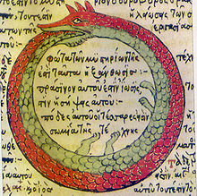

```
Created on  2019.05.24.15:44   
分形相关概念 改编：Moly Chin   
@author: molychin@qq.com   
```


**[递归](#### 递归)**


----
#### 递归
A visual form of recursion known as the Droste effect. The woman in this image holds an object that contains a smaller image of her holding an identical object, which in turn contains a smaller image of herself holding an identical object, and so forth. Advertisement for Droste cocoa, c. 1900 .

Recursion occurs when a thing is defined in terms of itself or of its type. Recursion is used in a variety of disciplines ranging from linguistics to logic. The most common application of recursion is in mathematics and computer science, where a function being defined is applied within its own definition. While this apparently defines an infinite number of instances (function values), it is often done in such a way that no loop or infinite chain of references can occur.

一种可视的递归形式，称为droste效果。在一个可可罐的广告贴中的女士端着一个托盘，托盘里有一杯咖啡和又一个有相同广告贴的可可罐，缩小的可可罐依然有一幅相同广告画。以此类推，每个依次缩小可可罐上都有一幅含有更小的可可罐的画，直到无穷。其实还可以做个更容易观察的实验，即人在两块面面相对的玻璃镜子中间观察，就可以看到无穷个逐次缩小的自己的镜像。

||
|:---:|
|《德罗斯特可可的广告》，约1900年|

递归发生在一个事物以其自身或其类型定义时。递归用于从语言学到逻辑的各种学科。递归最常见的应用是数学和计算机科学，其中定义的函数在其定义中应用。虽然这显然定义了无限数量的实例（函数值），但通常我们会指定一个 **是否要继续循环的最小阀值**，这样做的就不会出现无限的循环引用。


Formal definitions

Ouroboros, an ancient symbol depicting a serpent or dragon eating its own tail.
In mathematics and computer science, a class of objects or methods exhibit recursive behavior when they can be defined by two properties:
1. A simple base case (or cases)—a terminating scenario that does not use recursion to produce an answer
2. A set of rules that reduce all other cases toward the base case
For example, the following is a recursive definition of a person's ancestors:
• One's parents are one's ancestors (base case).
• The ancestors of one's ancestors are also one's ancestors (recursion step).

||
|:---:|
|Ouroboros，一个古老的象征，描绘了一条蛇或龙吃着自己的尾巴。|

在数学和计算机科学中，当一类对象或方法可以由两个属性定义时，它们显示递归行为：  
1.简单的基本情况-不使用递归生成答案的终止方案  
2.一组规则，用于将所有其他情况减少到基本情况  
例如，以下是一个人祖先的递归定义：
* 一个人的父母是一个人的祖先（基本情况）。
* 祖先的祖先也是祖先（递归步骤）。

The Fibonacci sequence is a classic example of recursion:
Many mathematical axioms are based upon recursive rules. For example, the formal definition of the natural numbers by the Peano axioms can be described as: 0 is a natural number, and each natural number has a successor, which is also a natural number. By this base case and recursive rule, one can generate the set of all natural numbers.
Recursively defined mathematical objects include functions, sets, and especially fractals.
There are various more tongue-in-cheek "definitions" of recursion; see recursive humor.

斐波那契序列是递归的经典例子：  
许多数学公理是基于递归规则的。例如，peano公理对自然数的形式定义可以描述为：0是一个自然数，每个自然数都有一个继承者，也就是一个自然数。根据这个基本情况和递归规则，可以生成所有自然数的集合。
递归定义的数学对象包括函数、集，尤其是分形。

Informal definition
Recently refreshed sourdough, bubbling through fermentation: therecipe calls for some sourdough left over from the last time the same recipe was made.
Recursion is the process a procedure goes through when one of the steps of the procedure involves invoking the procedure itself. A procedure that goes through recursion is said to be 'recursive'.
To understand recursion, one must recognize the distinction between a procedure and the running of a procedure. A procedure is a set of steps based on a set of rules. The running of a procedure involves actually following the rules and performing the steps. An analogy: a procedure is like a written recipe; running a procedure is like actually preparing the meal.

递归是过程的其中一个步骤涉及调用过程本身时过程所经历的过程。 经历递归的过程被称为“递归”。
要理解递归，必须认识到过程和过程运行之间的区别。 过程是基于一组规则的一组步骤。 程序的运行涉及实际遵循规则和执行步骤。 一个类比：程序就像一个书面配方; 运行程序就像实际准备膳食一样。

Recursion is related to, but not the same as, a reference within the specification of a procedure to the execution of some other procedure. For instance, a recipe might refer to cooking vegetables, which is another procedure that in turn requires heating water, and so forth. However, a recursive procedure is where (at least) one of its steps calls for a new instance of the very same procedure, like a sourdough recipe calling for some dough left over from the last time the same recipe was made. This of course immediately creates the possibility of an endless loop; recursion can only be properly used in a definition if the step in question is skipped in certain cases so that the procedure can complete, like a sourdough recipe that also tells you how to get some starter dough in case you've never made it before. Even if properly defined, a recursive procedure is not easy for humans to perform, as it requires distinguishing the new from the old (partially executed) invocation of the procedure; this requires some administration of how far various simultaneous instances of the procedures have progressed. For this reason recursive definitions are very rare in everyday situations. An example could be the following procedure to find a way through a maze. Proceed forward until reaching either an exit or a branching point (a dead end is considered a branching point with 0 branches). If the point reached is an exit, terminate. Otherwise try each branch in turn, using the procedure recursively; if every trial fails by reaching only dead ends, return on the path that led to this branching point and report failure. Whether this actually defines a terminating procedure depends on the nature of the maze: it must not allow loops. In any case, executing the procedure requires carefully recording all currently explored branching points, and which of their branches have already been exhaustively tried.

递归与一个过程的规范中的一个引用相关，但与该引用不同，该引用用于执行另一个过程。例如，菜谱可能涉及烹饪蔬菜，这是另一个程序，反过来需要加热水，等等。然而，递归过程是指（至少）它的一个步骤调用同一过程的一个新实例，例如调用上一次制作相同配方时留下的面团的“酸汤配方”。当然，这会立即产生无限循环的可能性；如果在某些情况下跳过了所讨论的步骤，则只能在定义中正确使用递归，这样过程就可以完成，就像一个sourdough配方，它还可以告诉您如何在以前从未做过的情况下获得一些启动面团。即使定义正确，递归过程对人类来说也不容易执行，因为它需要区分新的过程调用和旧的（部分执行的）过程调用；这需要对过程的各种同时实例的进展情况进行一些管理。因此，递归定义在日常情况下非常罕见。一个例子可以是下面的程序来找到穿过迷宫的方法。向前走，直到到达出口或分支点（死端被视为具有0个分支的分支点）。如果到达的点是出口，则终止。否则，使用递归过程依次尝试每个分支；如果每次尝试都失败，只到达死角，则返回导致此分支点的路径并报告失败。这是否真的定义了一个终止过程取决于迷宫的性质：它不能允许循环。在任何情况下，执行该过程都需要仔细记录所有当前探索的分支点，以及哪些分支已经被彻底尝试过。

递归，就是在运行的过程中调用自己。
构成递归需具备的条件：
1. 子问题须与原始问题为同样的事，且更为简单；
2. 不能无限制地调用本身，须有个出口，化简为非递归状况处理。

A classic example of recursion is the definition of the factorial function, given here in C code:
unsigned int factorial(unsigned int n) {
    if (n == 0) {
        return 1;
    } else {
        return n * factorial(n - 1);
    }
}

来自 <https://en.wikipedia.org/wiki/Recursion>


>待续.......
