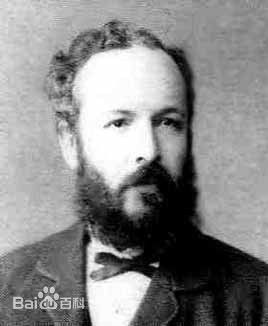
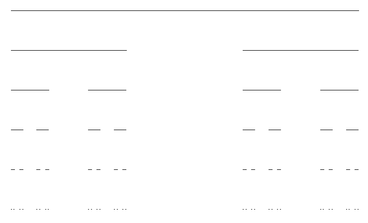
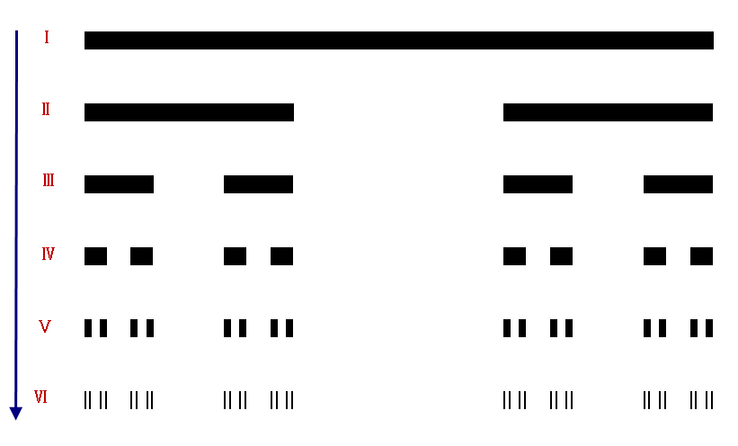
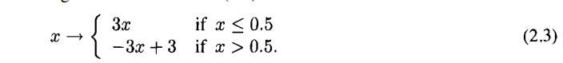
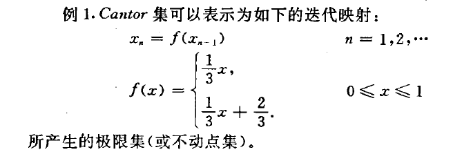
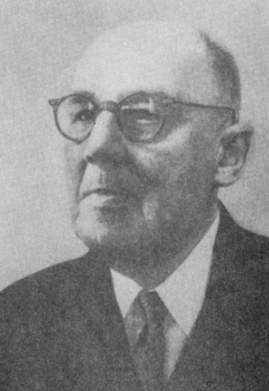

```
Created on  2019.05.24.15:44
经典的分形集 改编：Moly Chin
@author: molychin@qq.com
```

### 经典的分形集
[■cantor（康托）三分集](#■cantor（康托）三分集)  
[■Sierpinski三角形和Sierpinski地毯（正方形）](#■Sierpinski三角形和Sierpinski地毯（正方形）)  
[■Koch曲线](#■Koch曲线)  
[■Julia集](#■Julia集)  
[■Mandelbrot集](#■Mandelbrot集)  


#### ■cantor（康托）三分集


1883年，德国数学家康托(G.Cantor)构造了实变函数论中著名的“康托尔集”,给出测度为零的不可数集的一个例子,提出了如今广为人知的三分康托集，或称康托集。三分康托集是很容易构造的，然而，它却显示出许多最典型的分形特征。它是从单位区间出发，再由这个区间不断地去掉部分子区间的过程。
可以公平地说，在数学怪兽的动物园里——或者早期的分形——Cantor集是迄今为止最重要的，尽管它在视觉上不那么吸引人，而且很难在自然界中直接找到它的相似物。

|经典的Cantor集|改良的Cantor集|
|:---:|:---:|
|||

Cantor集的特性，在当时很令数学家感到困惑。
1. 任意小的线段[a,b]都不可能包含在Cantor集中；
2. Cantor集的测度为0；
3. Cantor集合合(0,1]中的全部实数一一对应。


##### 三分康托集的构造过程
构造出来的图像如上图所示。其详细构造过程是：
1. 把闭区间[0，1]平均分为三段，去掉中间的 1/3 部分段，则只剩下两个闭区间[0，1/3]和[2/3，1]。
2. 再将剩下的两个闭区间各自平均分为三段，同样去掉中间的区间段，这时剩下四段闭区间：[0，1/9]，[2/9，1/3]，[2/3，7/9]和[8/9，1]。
3. 重复删除每个小区间中间的 1/3 段。如此不断的分割下去， 最后剩下的各个小区间段就构成了三分康托集。 三分康托集的豪斯多夫维是0.6309。

```java
//绘制Cantor集
public void drawCantor(Graphics g, double ax, double ay, double bx,double by) {
  if ((bx - ax) < Constants.CANTOR_MIN_STEP) {
    //以画线段的方式呈现Cantor集
    //g.drawLine((int) ax, (int) ay, (int) bx, (int) by);
    //以画短实心线段（矩形）的方式呈现Cantor集
    g.fillRect((int) ax,(int) ay,(int)(bx-ax),Constants.CANTOR_WIDTH);
  } else {
    double cx = 0, cy = 0, dx = 0, dy = 0;
    //g.drawLine((int) ax, (int) ay, (int) bx, (int) by);
    g.fillRect((int) ax,(int) ay,(int)(bx-ax),Constants.CANTOR_WIDTH);
    cx = ax + (bx - ax) / 3;
    cy = ay + Constants.CANTOR_HIGHT;
    dx = bx - (bx - ax) / 3;
    dy = by + Constants.CANTOR_HIGHT;
    ay = ay + Constants.CANTOR_HIGHT;
    by = by + Constants.CANTOR_HIGHT;

    drawCantor(g, ax, ay, cx, cy);
    drawCantor(g, dx, dy, bx, by);
  }
}
```

##### Cantor集与混动动力系统的关系
看如下的一个连续迭代的帐篷函数：

或者


其函数图像是：


这个动力函数的收敛域刚好是一个Cantor集。

#### ■Sierpinski三角形和Sierpinski地毯（正方形）




#### ■Koch曲线
1904年，瑞典数学家柯赫构造了 “Koch曲线”几何图形。Koch曲线大于一维，具有无限的长度，但是又小于二维。它和三分康托集一样，是一个典型的分形。根据分形的次数不同，生成的Koch 曲线也有很多种，比如三次 Koch 曲线，四次 Koch 曲线等。下面以三次 Koch 曲线为例，介绍 Koch 曲线的构造方法，其它的可依此类推。

Koch 曲线的生成过程
三次Koch曲线的构造过程主要分为三大步骤：第一步，给定一个初始图形——一条线段；第二步，将这条线段中间的 1/3 处向外折起；第三步，按照第二步的方法不断的把各段线段中间的 1/3 处向外折起。这样无限的进行下去，最终即可构造出Koch曲线。其图例构造过程如右图所示(迭代了 5 次的图形)。

#### ■Julia集
Julia 集是由法国数学家 Gaston Julia 和 Pierre Faton 在发展了复变函数迭代的基础理论后获得的。Julia 集也是一个典型的分形，只是在表达上相当复杂，难以用古典的数学方法描述。

Julia 集
朱利亚集合由一个复变函数
 

 
生成，其中c为常数。
尽管这个复变函数看起来很简单，然而它却能够生成很复杂的分形图形。
右图为朱利亚集合生成的图形，由于c可以是任意值，所以当c取不同的值时，制出的图形也不相同。

#### ■Mandelbrot集


>continue....
