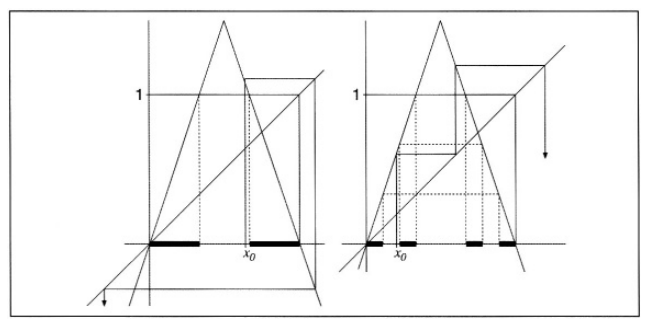

```
Created on  2019.05.24.15:44
经典的分形集 改编：Moly Chin
@author: molychin@qq.com
```

### 经典的分形集
[■cantor（康托）三分集](#cantor康托三分集)  
[■Sierpinski三角形和Sierpinski地毯（正方形）](#Sierpinski三角形和Sierpinski地毯)  
[■Koch曲线](#Koch曲线)  
[■Julia集](#Julia集)  
[■Mandelbrot集](#Mandelbrot集)  


#### ■cantor（康托）三分集


1883年，德国数学家康托(G.Cantor)构造了实变函数论中著名的“康托尔集”,给出测度为零的不可数集的一个例子,提出了如今广为人知的三分康托集，或称康托集。三分康托集是很容易构造的，然而，它却显示出许多最典型的分形特征。它是从单位区间出发，再由这个区间不断地去掉部分子区间的过程。
可以公平地说，在数学怪兽的动物园里——或者早期的分形——Cantor集是迄今为止最重要的，尽管它在视觉上不那么吸引人，而且很难在自然界中直接找到它的相似物。

|经典的Cantor集|改良的Cantor集|
|:---:|:---:|
|||

Cantor集的特性，在当时很令数学家感到困惑。
1. 任意小的线段[a,b]都不可能包含在Cantor集中；
2. Cantor集的测度为0；
3. Cantor集合合(0,1]中的全部实数一一对应。


##### 三分康托集的构造过程
构造出来的图像如上图所示。其详细构造过程是：
1. 把闭区间[0，1]平均分为三段，去掉中间的 1/3 部分段，则只剩下两个闭区间[0，1/3]和[2/3，1]。
2. 再将剩下的两个闭区间各自平均分为三段，同样去掉中间的区间段，这时剩下四段闭区间：[0，1/9]，[2/9，1/3]，[2/3，7/9]和[8/9，1]。
3. 重复删除每个小区间中间的 1/3 段。如此不断的分割下去， 最后剩下的各个小区间段就构成了三分康托集。 三分康托集的豪斯多夫维是0.6309。

```java
//绘制Cantor集
public void drawCantor(Graphics g, double ax, double ay, double bx,double by) {
  if ((bx - ax) < Constants.CANTOR_MIN_STEP) {
    //以画线段的方式呈现Cantor集
    //g.drawLine((int) ax, (int) ay, (int) bx, (int) by);
    //以画短实心线段（矩形）的方式呈现Cantor集
    g.fillRect((int) ax,(int) ay,(int)(bx-ax),Constants.CANTOR_WIDTH);
  } else {
    double cx = 0, cy = 0, dx = 0, dy = 0;
    //g.drawLine((int) ax, (int) ay, (int) bx, (int) by);
    g.fillRect((int) ax,(int) ay,(int)(bx-ax),Constants.CANTOR_WIDTH);
    cx = ax + (bx - ax) / 3;
    cy = ay + Constants.CANTOR_HIGHT;
    dx = bx - (bx - ax) / 3;
    dy = by + Constants.CANTOR_HIGHT;
    ay = ay + Constants.CANTOR_HIGHT;
    by = by + Constants.CANTOR_HIGHT;

    drawCantor(g, ax, ay, cx, cy);
    drawCantor(g, dx, dy, bx, by);
  }
}
```

##### Cantor集与混动动力系统的关系
看如下的一个连续迭代的帐篷函数：

或者


其函数图像是：


这个动力函数的收敛域刚好是一个Cantor集。

#### ■Sierpinski三角形和Sierpinski地毯

||
|:---:|
|Sierpinski|

|||
|:---:|:---:|
|Sierpinski 三角形|Sierpinski 逻辑三角形|

Generated using a random algorithm

Sierpinski triangle in logic: The first 16 conjunctions oflexicographically ordered arguments. The columns interpreted as binary numbers give 1, 3, 5, 15, 17, 51... (sequence A001317 in the OEIS)
The Sierpinski triangle (also with the original orthography Sierpiński), also called the Sierpinski gasket or the Sierpinski Sieve, is a fractal and attractive fixed set with the overall shape of an equilateral triangle, subdivided recursively into smaller equilateral triangles. Originally constructed as a curve, this is one of the basic examples of self-similar sets, i.e., it is a mathematically generated pattern that can be reproducible at any magnification or reduction. It is named after the Polish mathematician Wacław Sierpiński, but appeared as a decorative pattern many centuries prior to the work of Sierpiński.[1]

Constructions[edit]
There are many different ways of constructing the Sierpinski triangle.
Removing triangles[edit]
The Sierpinski triangle may be constructed from an equilateral triangle by repeated removal of triangular subsets:
1. Start with an equilateral triangle.
2. Subdivide it into four smaller congruent equilateral triangles and remove the central one.
3. Repeat step 2 with each of the remaining smaller triangles

Each removed triangle (a trema) is topologically an open set.[2] This process of recursively removing triangles is an example of a finite subdivision rule.
Shrinking and duplication[edit]
The same sequence of shapes, converging to the Sierpinski triangle, can alternatively be generated by the following steps:
1. Start with any triangle in a plane (any closed, bounded region in the plane will actually work). The canonical Sierpinski triangle uses an equilateral triangle with a base parallel to the horizontal axis (first image).
2. Shrink the triangle to 1/2 height and 1/2 width, make three copies, and position the three shrunken triangles so that each triangle touches the two other triangles at a corner (image 2). Note the emergence of the central hole—because the three shrunken triangles can between them cover only 3/4 of the area of the original. (Holes are an important feature of Sierpinski's triangle.)
3. Repeat step 2 with each of the smaller triangles (image 3 and so on).
Note that this infinite process is not dependent upon the starting shape being a triangle—it is just clearer that way. The first few steps starting, for example, from a square also tend towards a Sierpinski triangle. Michael Barnsley used an image of a fish to illustrate this in his paper "V-variable fractals and superfractals."[3]

The actual fractal is what would be obtained after an infinite number of iterations. More formally, one describes it in terms of functions on closed sets of points. If we let dA denote the dilation by a factor of 1/2 about a point A, then the Sierpinski triangle with corners A, B, and C is the fixed set of the transformation dA ∪ dB ∪ dC.
This is an attractive fixed set, so that when the operation is applied to any other set repeatedly, the images converge on the Sierpinski triangle. This is what is happening with the triangle above, but any other set would suffice.
Chaos game[edit]

Animated creation of a Sierpinski triangle using the chaos game
If one takes a point and applies each of the transformations dA, dB, and dC to it randomly, the resulting points will be dense in the Sierpinski triangle, so the following algorithm will again generate arbitrarily close approximations to it:[4]
Start by labeling p1, p2 and p3 as the corners of the Sierpinski triangle, and a random point v1. Set vn+1 = 1/2(vn + prn), where rn is a random number 1, 2 or 3. Draw the points v1 to v∞. If the first point v1 was a point on the Sierpiński triangle, then all the points vn lie on the Sierpinski triangle. If the first point v1 to lie within the perimeter of the triangle is not a point on the Sierpinski triangle, none of the points vn will lie on the Sierpinski triangle, however they will converge on the triangle. If v1 is outside the triangle, the only way vn will land on the actual triangle, is if vn is on what would be part of the triangle, if the triangle was infinitely large.

Animated construction of a Sierpinski triangle
Or more simply:
1. Take 3 points in a plane to form a triangle, you need not draw it.
2. Randomly select any point inside the triangle and consider that your current position.
3. Randomly select any one of the 3 vertex points.
4. Move half the distance from your current position to the selected vertex.
5. Plot the current position.
6. Repeat from step 3.
Note: This method is also called the chaos game, and is an example of an iterated function system. You can start from any point outside or inside the triangle, and it would eventually form the Sierpinski Gasket with a few leftover points (if the starting point lies on the outline of the triangle, there are no leftover points). It is interesting to do this with pencil and paper. A brief outline is formed after placing approximately one hundred points, and detail begins to appear after a few hundred.

Sierpinski triangle using an iterated function system
Arrowhead curve[edit]

Construction of the Sierpiński arrowhead curve
Another construction for the Sierpinski triangle shows that it can be constructed as a curve in the plane. It is formed by a process of repeated modification of simpler curves, analogous to the construction of the Koch snowflake:
1. Start with a single line segment in the plane
2. Repeatedly replace each line segment of the curve with three shorter segments, forming 120° angles at each junction between two consecutive segments, with the first and last segments of the curve either parallel to the original line segment or forming a 60° angle with it.
The resulting fractal curve is called the Sierpiński arrowhead curve, and its limiting shape is the Sierpinski triangle.[5]
Cellular automata[edit]
The Sierpinski triangle also appears in certain cellular automata (such as Rule 90), including those relating to Conway's Game of Life. For instance, the Life-like cellular automatonB1/S12 when applied to a single cell will generate four approximations of the Sierpinski triangle.[6] A very long one cell thick line in standard life will create two mirrored Sierpinski triangles. The time-space diagram of a replicator pattern in a cellular automaton also often resembles a Sierpinski triangle, such as that of the common replicator in HighLife.[7]
Pascal's triangle[edit]

A level-5 approximation to a Sierpinski triangle obtained by shading the first 25 (32) levels of a Pascal's triangle white if the binomial coefficient is even and black otherwise
If one takes Pascal's triangle with 2n rows and colors the even numbers white, and the odd numbers black, the result is an approximation to the Sierpinski triangle. More precisely, the limit as n approaches infinity of this parity-colored 2n-row Pascal triangle is the Sierpinski triangle.[8]
Towers of Hanoi[edit]
The Towers of Hanoi puzzle involves moving disks of different sizes between three pegs, maintaining the property that no disk is ever placed on top of a smaller disk. The states of an n-disk puzzle, and the allowable moves from one state to another, form an undirected graph that can be represented geometrically as the intersection graph of the set of triangles remaining after thenth step in the construction of the Sierpinski triangle. Thus, in the limit as n goes to infinity, this sequence of graphs can be interpreted as a discrete analogue of the Sierpinski triangle.[9]
Properties[edit]
For integer number of dimensions d, when doubling a side of an object, 2d copies of it are created, i.e. 2 copies for 1-dimensional object, 4 copies for 2-dimensional object and 8 copies for 3-dimensional object. For the Sierpinski triangle, doubling its side creates 3 copies of itself. Thus the Sierpinski triangle has Hausdorff dimension log(3)/log(2) ≈ 1.585, which follows from solving 2d = 3 for d.[10]
The area of a Sierpinski triangle is zero (in Lebesgue measure). The area remaining after each iteration is clearly 3/4 of the area from the previous iteration, and an infinite number of iterations results in zero.[11]
The points of a Sierpinski triangle have a simple characterization in Barycentric coordinates.[12] If a point has coordinates (0.u1u2u3…, 0.v1v2v3…, 0.w1w2w3…), expressed as Binary numbers, then the point is in Sierpinski's triangle if and only if ui + vi + wi = 1 for all i.
Generalization to other Moduli[edit]
A generalization of the Sierpinski triangle can also be generated using Pascal's triangle if a different Modulo is used. Iteration n can be generated by taking a Pascal's triangle with Pn rows and coloring numbers by their value for x mod P. As n approaches infinity, a fractal is generated.
The same fractal can be achieved by dividing a triangle into a tessellation of P2 similar triangles and removing the triangles that are upside-down from the original, then iterating this step with each smaller triangle.
Conversely, the fractal can also be generated by beginning with a triangle and duplicating it and arranging n(n + 1)/2 of the new figures in the same orientation into a larger similar triangle with the vertices of the previous figures touching, then iterating that step.[13]
Analogues in higher dimensions[edit]

A Sierpinski square-based pyramid and its 'inverse'

Sierpinski pyramid recursion progression (7 steps)

A Sierpiński triangle-based pyramid as seen from above (4 main sections highlighted). Note the self-similarity in this 2-dimensional projected view, so that the resulting triangle could be a 2D fractal in itself.
The Sierpinski tetrahedron or tetrix is the three-dimensional analogue of the Sierpinski triangle, formed by repeatedly shrinking a regular tetrahedron to one half its original height, putting together four copies of this tetrahedron with corners touching, and then repeating the process. This can also be done with a square pyramid and five copies instead.
A tetrix constructed from an initial tetrahedron of side-length L has the property that the total surface area remains constant with each iteration. The initial surface area of the (iteration-0) tetrahedron of side-length L is L2√3. The next iteration consists of four copies with side length L/2, so the total area is 4(L/2)2√3 = 4L2√3/4 = L2√3again. Meanwhile the volume of the construction is halved at every step and therefore approaches zero. The limit of this process has neither volume nor surface but, like the Sierpinski gasket, is an intricately connected curve. Its Hausdorff dimension is log(4)/log(2) = 2. If all points are projected onto a plane that is parallel to two of the outer edges, they exactly fill a square of side length L/√2 without overlap.

Animation of a rotating level-4 tetrix showing how some orthographic projections of a tetrix can fill a plane – inthis interactive SVG, move left and right over the tetrix to rotate the 3D model
Numerical generation[edit]
A short code in the Mathematica internal language: the recursive procedure SiPyramid generates a 3D pyramid of arbitrary order n as the displayable graphic object Graphics3D:
vect[1] = {0, 0, 0};
vect[2] = {1, 0, 0};
vect[3] = {0.5, 3^0.5/2, 0};
vect[4] = {0.5, 1/3*3^0.5/2, ((3^0.5/2)^2 - (1/3*3^0.5/2)^2)^0.5};
Tetron[{i_, j_, k_}] :=
 Tetrahedron[{vect[1] + {i, j, k}, vect[2] + {i, j, k}, vect[3] + {i, j, k}, vect[4] + {i, j, k}}];
SiPyramid[0, {i_, j_, k_}] := {Tetron[{i, j, k}]};
SiPyramid[n_, {i_, j_, k_}] :=
  Module[{s = {}},
   Do[s = Union[s,
      SiPyramid[n - 1, 2^(n - 1)*vect[u] + {i, j, k}]], {u, 4}]; s];
History[edit]
Wacław Sierpiński described the Sierpinski triangle in 1915. However, similar patterns appear already in the 13th-century Cosmati mosaics in the cathedral of Anagni, Italy,[14] and other places of central Italy, for carpets in many places such as the nave of the Roman Basilica of Santa Maria in Cosmedin,[15] and for isolated triangles positioned in rotae in several churches and Basiliche.[1] In the case of the isolated triangle, it is interesting to notice that the iteration is at least of three levels.
Etymology[edit]
The usage of the word "gasket" to refer to the Sierpinski triangle refers to gaskets such as are found in motors, and which sometimes feature a series of holes of decreasing size, similar to the fractal; this usage was coined by Benoît Mandelbrot, who thought the fractal looked similar to "the part that prevents leaks in motors".[16]
See also[edit]
• Apollonian gasket, a set of mutually tangent circles with the same combinatorial structure as the Sierpinski triangle
• List of fractals by Hausdorff dimension
• Sierpinski carpet, another fractal named after Sierpinski and formed by repeatedly removing squares from a larger square
• Triforce

来自 <https://en.wikipedia.org/wiki/Sierpinski_triangle>


#### ■Koch曲线
1904年，瑞典数学家柯赫构造了 “Koch曲线”几何图形。Koch曲线大于一维，具有无限的长度，但是又小于二维。它和三分康托集一样，是一个典型的分形。根据分形的次数不同，生成的Koch 曲线也有很多种，比如三次 Koch 曲线，四次 Koch 曲线等。下面以三次 Koch 曲线为例，介绍 Koch 曲线的构造方法，其它的可依此类推。

Koch 曲线的生成过程
三次Koch曲线的构造过程主要分为三大步骤：第一步，给定一个初始图形——一条线段；第二步，将这条线段中间的 1/3 处向外折起；第三步，按照第二步的方法不断的把各段线段中间的 1/3 处向外折起。这样无限的进行下去，最终即可构造出Koch曲线。其图例构造过程如右图所示(迭代了 5 次的图形)。

#### ■Julia集
Julia 集是由法国数学家 Gaston Julia 和 Pierre Faton 在发展了复变函数迭代的基础理论后获得的。Julia 集也是一个典型的分形，只是在表达上相当复杂，难以用古典的数学方法描述。

Julia 集
朱利亚集合由一个复变函数
 

 
生成，其中c为常数。
尽管这个复变函数看起来很简单，然而它却能够生成很复杂的分形图形。
右图为朱利亚集合生成的图形，由于c可以是任意值，所以当c取不同的值时，制出的图形也不相同。

#### ■Mandelbrot集


>continue....
